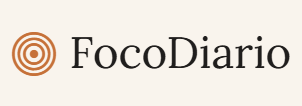
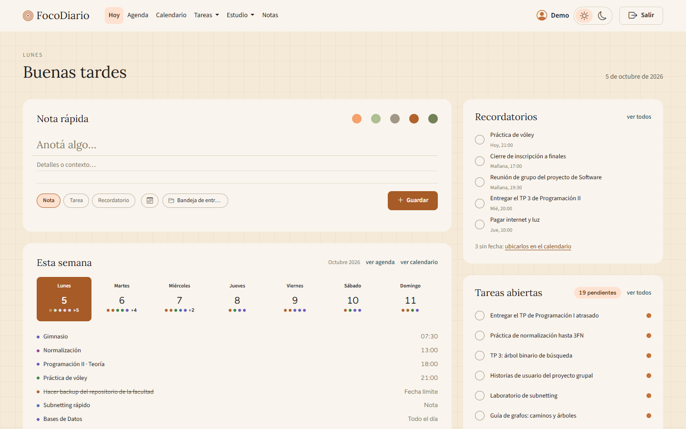
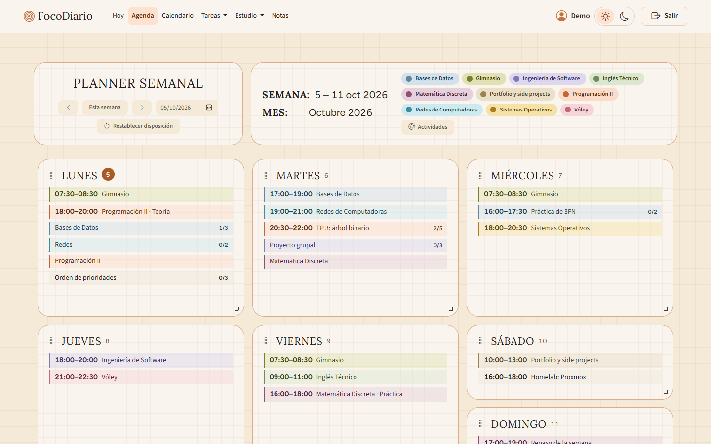
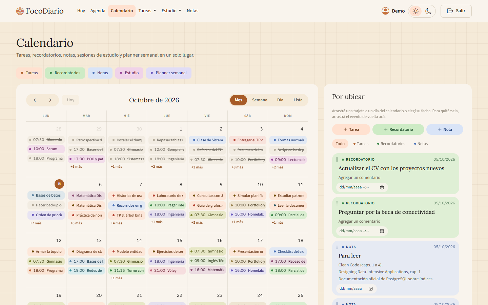
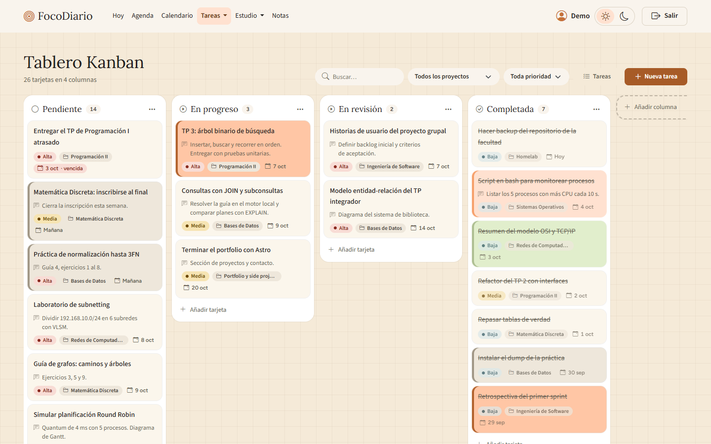
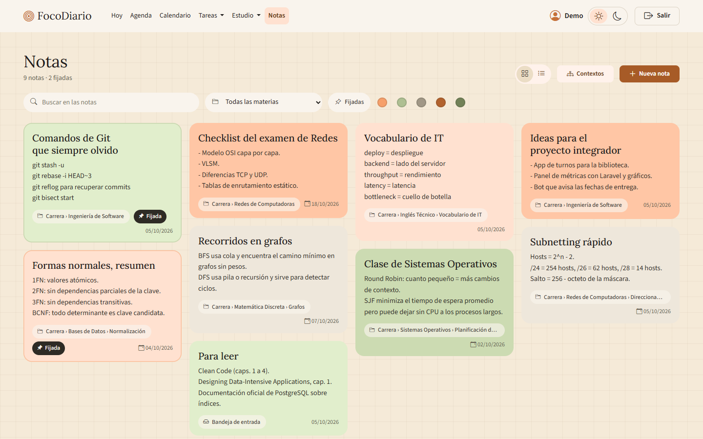
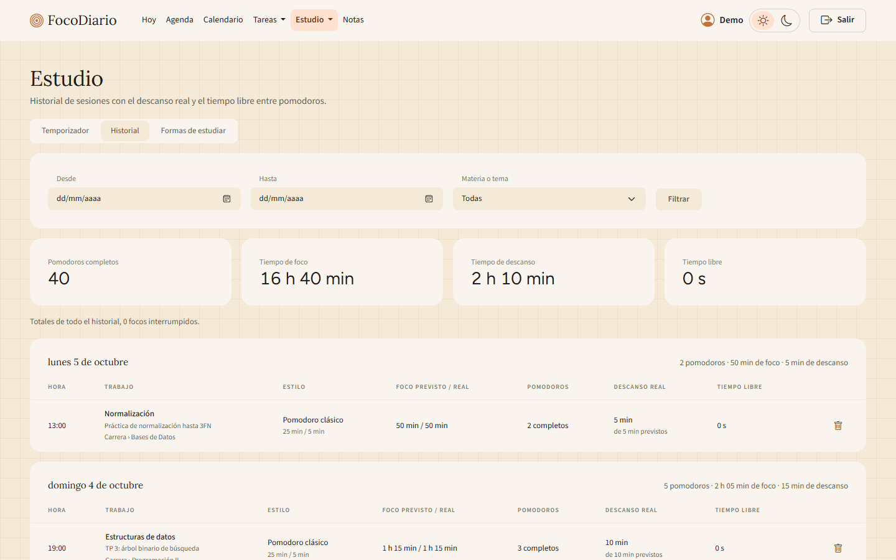
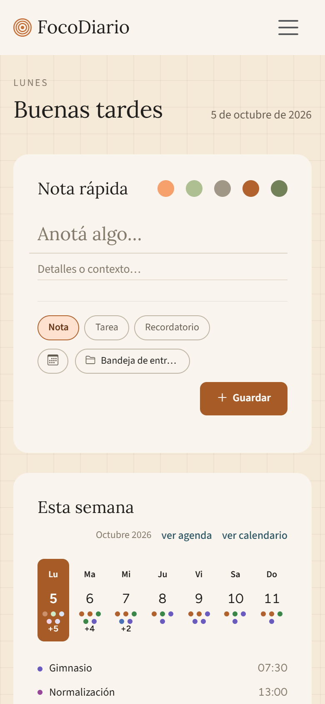

<p align="center">
  
</p>

<p align="center">
  <em>Menos ocio, más foco. Un día a la vez.</em>
</p>

<p align="center">
  <a href="https://focodiario-cevg.onrender.com"><strong>Probar FocoDiario gratis →</strong></a>
  <br>
  <sub>Sin registro: se puede usar como invitado y crear una cuenta después.</sub>
</p>

<p align="center">
  
</p>

## ¿Qué es FocoDiario?

**FocoDiario** es una aplicación web de organización personal que reúne en un solo lugar lo que normalmente está repartido en varias herramientas: notas, tareas, recordatorios, calendario y seguimiento del estudio. No busca competir con Google Calendar o Notion, sino tener todo lo del día a mano, con el calendario como eje.

Está pensada para estudiantes y para cualquiera que quiera ver en qué se le va el tiempo y equilibrar estudio, proyectos y descanso.

## Funcionalidades

### Hoy
La jornada de un vistazo: una nota rápida (como nota, tarea o recordatorio), la semana en curso, los recordatorios pendientes, las tareas abiertas y un pomodoro integrado.

### Agenda
Planificador semanal con bloques por materia o proyecto, listas de verificación y colores para distinguir cada actividad.



### Calendario
Vista mensual, semanal y de lista con todo lo que tiene fecha. Los recordatorios sin fecha esperan en una bandeja lateral hasta ubicarlos.



### Tareas
Lista y tablero kanban con columnas personalizables, prioridades, fechas límite, proyectos y tarjetas de color.



### Notas
Notas con título, color y proyecto, con la opción de fijar las importantes arriba.



### Estudio
Temporizador pomodoro que sigue visible en todas las pantallas mientras corre, historial del tiempo de foco y descanso por día y recomendaciones según el uso.



### En el celular
El diseño se adapta a pantallas chicas, con modo claro y oscuro.

<p align="center">
  
</p>

## Cuentas y privacidad

- **Modo invitado:** se puede usar sin registrarse. Los datos quedan asociados a ese navegador.
- **Cuenta:** al crear una cuenta, lo cargado como invitado se transfiere a ella y queda disponible en cualquier dispositivo.
- **Aislamiento:** cada usuario ve únicamente sus propios datos. Las contraseñas se guardan cifradas con hash.

## Stack

- **Backend:** Laravel 13 (PHP 8.4)
- **Frontend:** Blade, HTMX 2, Bootstrap 5, FullCalendar, Gridstack y JavaScript sin framework, compilado con Vite
- **Base de datos:** PostgreSQL en producción (Neon), SQLite en desarrollo
- **Despliegue:** Docker con FrankenPHP en Render

## Desarrollo local

Requisitos: PHP 8.4, Composer y Node.js.

```bash
composer run setup   # instala dependencias, crea .env, genera la clave, migra y compila assets
composer run dev     # levanta el servidor y Vite
composer run test    # corre la suite de tests
```

## Despliegue

La imagen se construye con el `Dockerfile` del repositorio. Al iniciar, `docker/entrypoint.sh` ejecuta las migraciones y cachea la configuración. Variables necesarias en producción:

| Variable | Valor |
|---|---|
| `DB_CONNECTION` | `pgsql` |
| `DB_URL` | Cadena de conexión directa de Postgres (con `sslmode=require`) |
| `APP_KEY` | Salida de `php artisan key:generate --show` |
| `APP_ENV` | `production` |
| `APP_DEBUG` | `false` |
| `SESSION_DRIVER` | `database` |

La demo corre en el plan gratuito de Render: la primera visita tras un rato de inactividad puede tardar unos 50 segundos.

## Documentación

1. [Visión y objetivos](docs/01-vision-y-objetivos.md)
2. [Requisitos y funcionalidades](docs/02-requisitos-y-funcionalidades.md)
3. [Investigación de estudio](docs/03-investigacion-estudio.md)
4. [Stack tecnológico](docs/04-stack-tecnologico.md)
5. [Ideas de funcionalidades](docs/05-ideas-de-funcionalidades.md)
6. [Inicio y notas](docs/06-inicio-y-notas.md)
